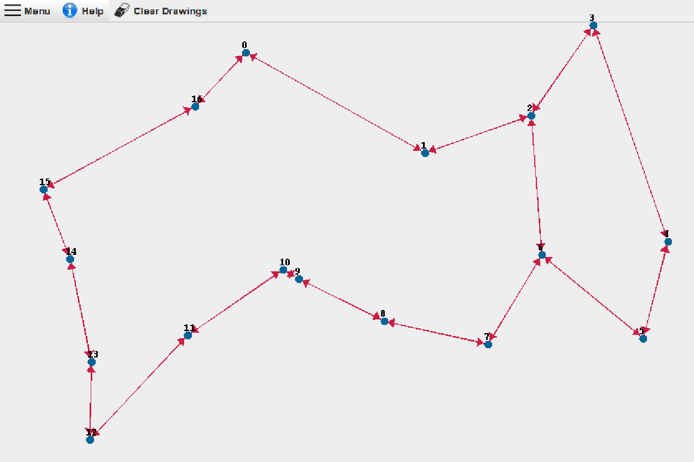
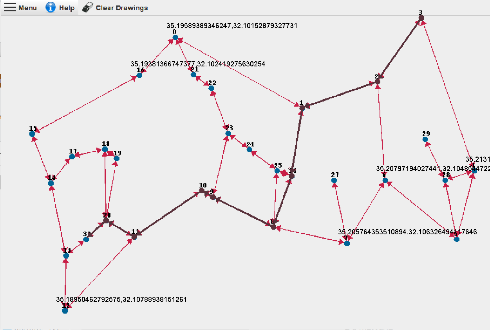

# Task 2 Object-Oriented Programming
Directed Weighted Graph Algorithm, designing a graph interface.

<!-- TABLE OF CONTENTS -->

  
Content

  <ol>
    <li><a href="#about-the-project">About The Project</a></li>
    <li><a href="#about-the-project">Plan and design of The Project</a></li>
    <li><a href="#the-algorithm">The Algorithm</a></li>
    <li><a href="#Gui">GUI</a></li>
    <li><a href="#results">Results</a></li>
    <li><a href="#languages-and-tools">Languages and Tools</a></li>
    <li><a href="#acknowledgements">Acknowledgements</a></li>
    <li><a href="#contact">Contact</a></li>
  </ol>

<!-- ABOUT THE PROJECT -->
## About The Project

####Task 2 Object-Oriented Programming

***Authors : Shauli Taragin & Ido Bar***  

In this project we implemented algorithms for developing a data structure into a directional weighted graph which implements many algorithms.

We also created a Graphical User Interface to visualize any given directed weighted graph, and it's implemented methods and algorithms.

---------

## Plan and design of The Project

Upon planning are project we would like to focus on 3 fields for which we wish to plan elaborately before we begin implementing code.
<li> Planning the main classes:</li>
We will implement a class for each interface. Our node , edge, geoLocation and DirectedWeightedGraph classes will hold all the function it implements from the interface as well as variables which we will elaborate on in the next paragraph.
We will also implement an algorithm class which implements DirectedWeightedGraphAlgorithms. In that class we will also create our main algorithm.
<li> Planning the method of implementation:</li>
We will create HashMap that every key is the Node Id and the value is the NodeData Object.
Every NodeData will contain two HashMaps:1. HashMap of the edges that the current node is their source, the key of the HashMap will be the Id of the destination node and the value will be the Edge.
2. HashMap of the Edges that the current node is their destination.
The key will be the Id of the source node and the value will be the weight of the edge.
<li> Laying out testing methods :</li>
We would like to check the next methods:1. Creat graph by adding nodes and edges.
2. Connect two nodes. 3. Delete node. 4. Delete edge from the graph. 5. Get the correct mode count.
6. Get the correct size of edges and the correct size of nodes.

---------

## The Algorithm

---------

## GUI
#### We will explain about our gui as well as give a short and easy manual of how the user can use it easily.

###### Note - The user must first load a graph from the menu in order to display it 
* About our GUI :
In our display of the graph the user must first load A graph from a json file of their choice which is located in the data package.

The graph is represented in the following manner : 

Nodes are represented by blue circles. Each nodes key is written above it in black.

Edges are represented by red lines with an arrow at the end showing the direction of the edge.

Pressing on each node will show each node's geolocation. To unshow the location press clear.</li> 
* Functions and algorithm within our GUI 
1. Load: Allows user to load A graph from A json file from our data package.  
2. Save: Allows user to save A graph into A json file to our data package.
3. Edit graphs: Allows user to make changes to graph.
    1. Add Node: Allows user to add a node to the graph by typing in the id(key) of the node and its geolocation. If the node already exits it will rewrite its location. Writing wrong id or wrong cordinance will throw an error.
    2. Remove Node:Allows user to remove a node from the graph by typing in the id(key) of the node. Writing wrong id  will throw an error.
    3. Connect: Allows user to connect between 2 nodes an edge(with direction src/dst) in the graph by typing in the id(key) of the source node, id(key) of the destination node  and the weight of the edge. If the edge already exits it will rewrite its weight. Writing wrong id or wrong weight will throw an error.
    4. Remove edge:Allows user to remove an edge from the graph by typing in the id(key) of the node src and id(key) of the node dest. Writing wrong id's  will throw an error.
4. Algorithms: Allows user to run and visualize algorithms on the graph .
   1. Center: Pressing this button will represent on the screen what is the center of the graph. The node which is colored in light blue is the center node of the graph.
   2. IsConnected:Pressing this button will represent on the screen A message that lets the user know whether the graph is connected.
   3. TSP: Allows user to insert nodes(by key) into the tsp algorithm. When the user is ready they can press submit, and the screen will show the path taken visiting all the nodes in tsp. First node is marked in orange,final node in pink. The edges which have been visited will become black(including their arrows).
   4. Shortest Dist: Allows user to insert 2 nodes(by key of src and dest). The screen will show the shortest path possible between the nodes. First node is marked in orange , final node in pink. The edges which have been visited will become black(including their arrows).
   5. Shortest Dist Path: Allows user to insert 2 nodes(by key of src and dest). The screen will show a message with the shortest path possible between the nodes by the sum of the weights taken.
5. Exit: Allows the user to exit the program.

* Help button refers the user to this user manual in our github repository.

* Clear button clears the drawings on top of the loaded graph. i.e geolocation , shortestdist, center etc..

---------

## Languages and Tools

  

<code></code>
<code></code>
<code></code>
<code></code>
<code></code>
<code></code>
<code></code>
  

<!-- ACKNOWLEDGEMENTS -->
## Acknowledgements
* [Python](https://en.wikipedia.org/wiki/Java_(programming_language))
* [UML](https://en.wikipedia.org/wiki/Unified_Modeling_Language)
* [Git](https://git-scm.com/)
* [Jupyter](https://jupyter.org/)
* [Pandas](https://pandas.pydata.org/)
* [Git-scm](https://git-scm.com/book/en/v2/Getting-Started-Installing-Git)

<!-- CONTACT -->
## Contact

Ido - [here](https://github.com/idobar1403/)

Shauli - [here](https://github.com/ShauliTaragin/)

Project Link: [here](https://github.com/ShauliTaragin/OOP_Ex2)